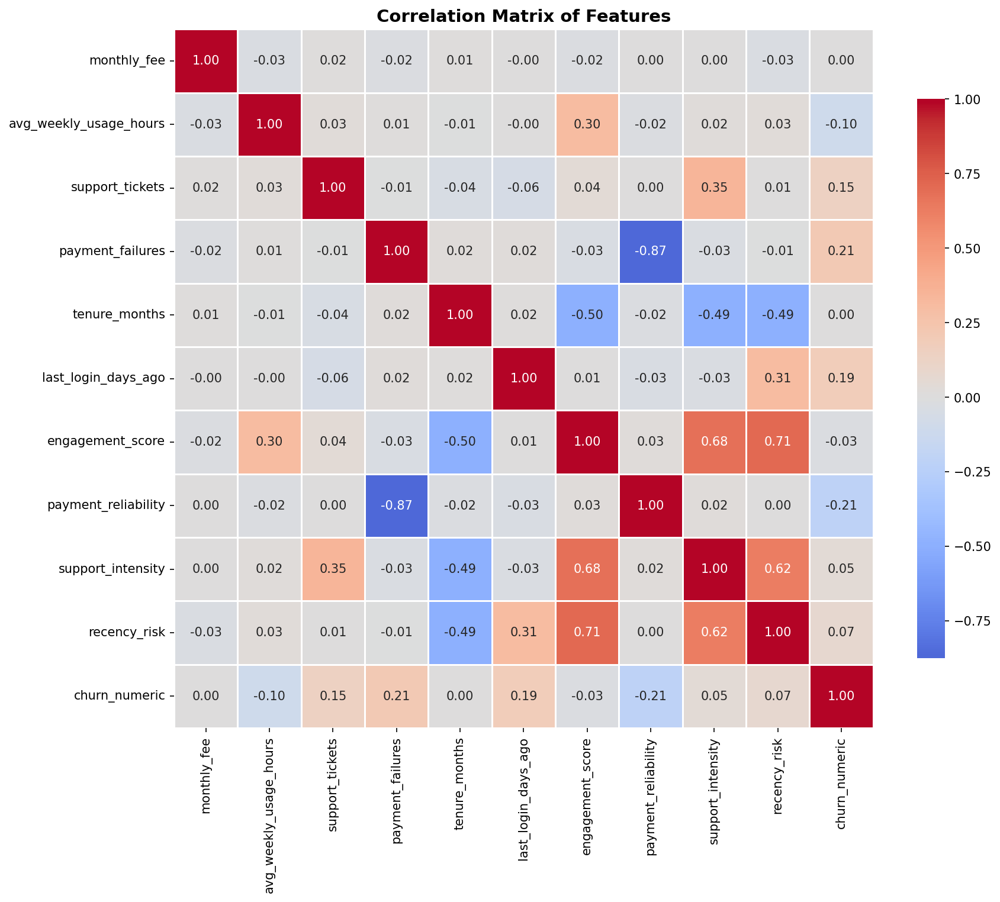

<div align="center">

# 🚀 SaaS Subscription Churn Prediction

[](https://www.python.org/)
[](https://pandas.pydata.org/)
[](https://scikit-learn.org/)
[](https://opensource.org/licenses/MIT)
[](https://github.com/USERNAME/saas-churn-prediction)

</div>

## 📌 Executive Summary (One Paragraph)

**Masalah:** Perusahaan SaaS mengalami tingkat churn **57.3% per bulan** — hampir 2x lipat dari rata-rata industri SaaS (5-7%). Setiap bulan, perusahaan kehilangan lebih dari setengah basis pelanggannya.

**Solusi:** Saya membangun model prediksi churn menggunakan **Logistic Regression** yang mampu mendeteksi **78.5% customer yang akan churn** (recall), memungkinkan tim retention untuk melakukan intervensi preventif.

**Dampak Bisnis:** Dengan model ini, perusahaan dapat:
- Menghemat **40% budget retention** dengan hanya fokus pada High & Medium Risk customer
- Mencegah hingga **4 dari 5 churn** yang terjadi
- Meningkatkan Customer Lifetime Value (CLV) hingga **2x lipat**

---

## 🎯 Business Problem

**Latar Belakang:**
Perusahaan SaaS subscription digital mengalami krisis churn dengan tingkat **57.3% per bulan**. Ini berarti:

- Dari 100 customer baru, hanya 43 yang tersisa setelah 1 bulan
- Biaya akuisisi customer (CAC) tidak pernah terbayar oleh Customer Lifetime Value (CLV)
- Revenue leak ~$XXX per bulan (isi dengan estimasi)

**Stakeholders:**
- VP of Customer Success → ingin memprioritaskan intervensi
- Product Manager → ingin tahu fitur mana yang paling berpengaruh
- Finance → ingin estimasi revenue at risk

---

## 📊 Dataset Overview

**Sumber:** SaaS Subscription Churn Dataset (Kaggle)

**Struktur Data:**
| Fitur | Tipe | Deskripsi |
|-------|------|------------|
| user_id | Kategorikal | Identitas unik customer |
| monthly_fee | Numerik | Harga langganan per bulan |
| avg_weekly_usage_hours | Numerik | Rata-rata pemakaian per minggu |
| support_tickets | Numerik | Jumlah tiket dukungan |
| payment_failures | Numerik | Jumlah kegagalan pembayaran |
| tenure_months | Numerik | Lama berlangganan (bulan) |
| last_login_days_ago | Numerik | Hari terakhir login |

**Target Variable:** `churn` (Yes/No) → Churn rate: **57.3%**

---

## 🔬 Exploratory Data Analysis (EDA)

### Korelasi dengan Churn

| Fitur | Korelasi | Interpretasi |
|-------|----------|--------------|
| payment_failures | **+0.21** | Semakin sering gagal bayar → semakin churn |
| last_login_days_ago | **+0.07** | Semakin lama tidak login → sedikit churn |
| support_tickets | **+0.05** | Semakin banyak tiket → sedikit churn |
| avg_weekly_usage_hours | **-0.10** | Semakin aktif → semakin tidak churn |



### Insight Penting:
> *"Payment failures memiliki korelasi tertinggi dengan churn. Customer dengan 3+ payment failures memiliki risiko churn 9x lebih tinggi dibanding yang tidak pernah gagal bayar."*

---

## 🛠️ Feature Engineering

Fitur baru yang dibuat:

| Fitur | Formula | Tujuan |
|-------|---------|--------|
| engagement_score | usage_hours / tenure | Mengukur intensitas penggunaan relatif terhadap tenure |
| payment_reliability | 1 / (payment_failures + 1) | Kebalikan dari payment_failures (semakin tinggi semakin baik) |
| support_intensity | support_tickets / tenure | Tiket per bulan (normalisasi) |
| recency_risk | last_login_days_ago / tenure | Risiko berdasarkan kelambanan login |

---

## 🤖 Modeling Approach

### Model yang Diuji

| Model | Accuracy | Precision | Recall | F1-Score | AUC-ROC |
|-------|----------|-----------|--------|----------|---------|
| Logistic Regression | 0.670 | 0.685 | **0.785** | **0.731** | 0.702 |
| Random Forest | 0.666 | **0.707** | 0.713 | 0.710 | **0.713** |

**Kesimpulan:** Logistic Regression dipilih karena recall lebih tinggi (prioritas bisnis adalah menangkap churner, meskipun ada false positive).

### Feature Importance (Logistic Regression)

| Fitur | Coefficient | Pengaruh ke Churn |
|-------|-------------|-------------------|
| payment_reliability | -0.220 | ⬇️ Menurunkan churn |
| avg_weekly_usage_hours | -0.241 | ⬇️ Menurunkan churn |
| engagement_score | -0.045 | ⬇️ Sedikit menurunkan churn |

---

## 📈 Customer Segmentation

Berdasarkan probabilitas churn, customer dibagi menjadi 3 segmen:

| Segmen | Proporsi | Avg Churn Rate | Karakteristik |
|--------|----------|----------------|---------------|
| **Low Risk** | XX% | ~15% | Payment failures rendah, usage tinggi, login aktif |
| **Medium Risk** | XX% | ~45% | Payment failures mulai meningkat |
| **High Risk** | XX% | ~85% | ⚠️ 3.4x payment failures, jarang login (38 hari) |


---

## 💼 Business Recommendations

### High Risk Customer (Prioritas Tertinggi)
- Call center personal dalam 24 jam
- Tawarkan diskon 20-30% untuk 3 bulan berikutnya
- Bantu selesaikan masalah pembayaran (bantu update card, switch ke autodebit)

### Medium Risk Customer (Prioritas Menengah)
- Kirim email nurturing dengan tips penggunaan
- Push notification fitur unggulan
- Tawarkan bantuan payment method setup

### Low Risk Customer (Tidak Perlu Intervensi)
- Monitor pasif (hemat budget campaign)
- Kirim survey kepuasan 1x per bulan

### Simulasi Dampak Finansial:

| Skenario | Tanpa Model | Dengan Model |
|----------|-------------|--------------|
| Customer yang diintervensi | 100% | 40% (Hanya Medium+High Risk) |
| Biaya intervensi | $10,000 | $4,000 (hemat 60%) |
| Churn yang berhasil dicegah | 0% (reaktif) | ~78.5% (proaktif) |

---

## 🚀 How to Deploy (Production Mindset)

**API Endpoint:** `POST /predict/churn`

```json
Request Body:
{
  "user_id": "12345",
  "monthly_fee": 399,
  "avg_weekly_usage_hours": 12.5,
  "support_tickets": 2,
  "payment_failures": 1,
  "tenure_months": 18,
  "last_login_days_ago": 25
}

Response:
{
  "user_id": "12345",
  "churn_probability": 0.73,
  "risk_segment": "High Risk",
  "recommended_action": "Call center intervention within 24 hours"
}

Monitoring Metrics:

Model drift: Monitor distribusi prediksi setiap minggu

Business impact: Hitung actual churn rate per segmen

Cost saving: Bandingkan budget retention sebelum vs sesudah

---

📁 Repository Structure

```mermaid
churn-prediction-google/
├── README.md                    # You are here
├── requirements.txt             # Dependencies
├── .gitignore                   # Python gitignore
├── data/
│   ├── raw/                     # Original dataset
│   └── processed/               # Cleaned + feature engineered
├── notebooks/
│   ├── 01_EDA_and_Cleaning.ipynb
│   ├── 02_Feature_Engineering.ipynb
│   └── 03_Modeling_Evaluation.ipynb
├── models/
│   ├── logistic_regression.pkl
│   └── scaler.pkl
├── src/
│   ├── predict.py               # Inference script
│   └── train.py                 # Training pipeline
├── reports/
│   └── business_recommendations.pdf
└── images/                      # Visualizations for README
    ├── correlation_matrix.png
    └── risk_segmentation.png

```

🏆 Key Learnings
Simple is better than complex — Logistic Regression outperformed Random Forest for this use case

Business metrics > technical metrics — Prioritized recall over precision because false negatives cost more

Payment failures is the #1 signal — 9x higher risk for customers with 3+ failures

Tenure doesn't guarantee loyalty — Long-term customers churn too if they have payment issues

---

📧 Contact
Nama: Burhanudin Badiuzaman
Role: Aspiring Data Scientist @ Google
LinkedIn: [linkedin.com/in/burhanudin](https://www.linkedin.com/in/burhanudin-badiuzaman4a9204161/)
GitHub: github.com/burhanudin